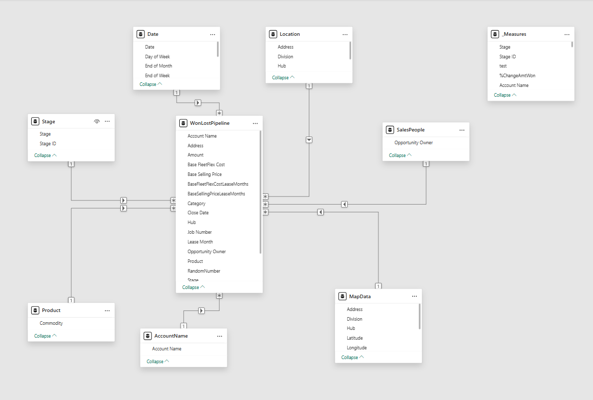

📄 ELT_ProcessFL.md 
# 🔄 ELT Process: FleetLeasing CRM Pipeline Dashboard

This document outlines the data preparation workflow for the FleetLeasing Power BI report, modeled on anonymized Salesforce opportunity data. The ELT process was designed to streamline CRM pipeline analysis while safeguarding client data and enhancing visual clarity.

---

## 🟢 Extract

- **Source System**: Salesforce CRM export (opportunity-level data)
- **Raw Dataset**: A multi-table export reflecting thousands of sales opportunities
- **Data Scope**:
  - Opportunity status
  - Close dates and pipeline stages
  - Commodities quoted
  - Sales representatives and account-level detail
- **Anonymization Goals**: Replace sensitive client details and internal identifiers while preserving analytical value

---

## 🟡 Load

- Imported CSV exports into **Power BI Desktop**
- Key tables:
  - **`WonLostPipeline`** (primary fact table)
  - **`Dim-Division`**
  - **`Dim-Stage`**
  - **`Dim-Commodity`**
  - **`Dim-SalesPeople`** (Opportunity Owner)
  - **`Dim-Date`** (custom date table with formatting)
- Parameters:
  - **`startDate`** and **`endDate`** set up in Power Query to filter dataset time frame

### Tables Not Loaded

- **`Dim-Opportunity`** (excluded due to volume > 9,000 records)
  - Used **Power Query Index column** to simulate unique `Opportunity ID`
- **`Dim-Account`** (not loaded as standalone)
  - Joined account fields directly into `WonLostPipeline` based on `Account Name`

---

## 🔵 Transform

### 🔐 Anonymization & Mapping (AI-Assisted)

Used AI-generated mapping tables for:

- `791` Account Names  
- `28` Sales People  
- `25` Commodities  
- `6` Locations  

Each table included `Original Value` and `Anonymized Value`. Columns in `WonLostPipeline` were merged with these mappings and the originals removed to complete the privacy workflow.

### 💰 Lease Pricing Simulation

Added a calculated field for lease-adjusted pricing:

- Generated **random lease term multipliers** using Power Query
- Applied conditional logic to compute adjusted pricing based on lease length:
  ```powerquery
  = Table.AddColumn(#"Filled Down", "BaseSellingPriceLeaseMonths", each
  if [Lease Month] = 24 then [Base Selling Price] * 1.75
  else if [Lease Month] = 48 then [Base Selling Price] * 2.60
  else if [Lease Month] = 64 then [Base Selling Price] * 3.30
  else [Base Selling Price])

## 🧠 Data Model Overview

The report uses a **star schema** structure for optimized filtering, aggregation, and drill-through capabilities:

- **Fact Table**: `WonLostPipeline`

- **Dimension Tables**:
  - `Division` → joined on `Division`
  - `Stage` → on `Stage`
  - `Commodity` → on `Commodity`
  - `SalesPeople` → on `Sales People`
  - `Account` → on `Account Name`
  - `Date` → on `Close Date`

All relationships follow a **many-to-one (`*:1`)** cardinality and are configured with **referential integrity**. This model supports robust cross-filtering, optimized visuals, and scalable DAX development.

## 👁️ Visual Schema Overview

Below is the Power BI model used in this project, structured as a star schema:



_Visual of the FleetLeasing star schema model, including the `WonLostPipeline` fact table and its connected dimensions._

