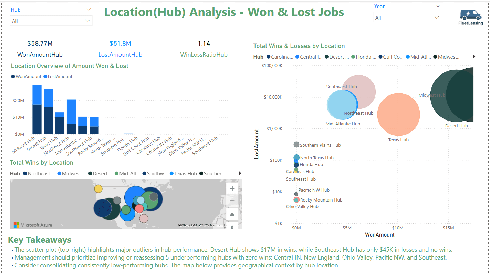
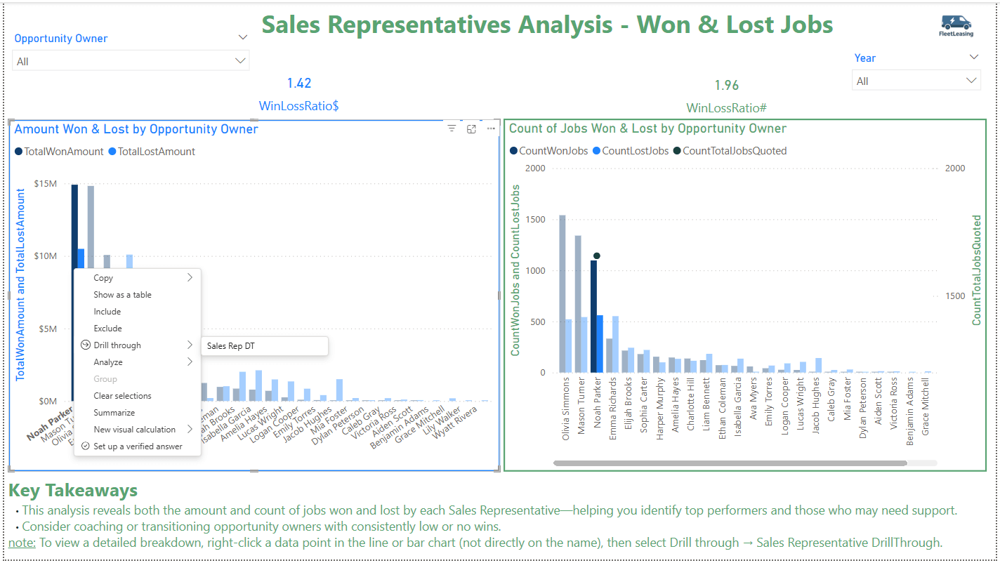
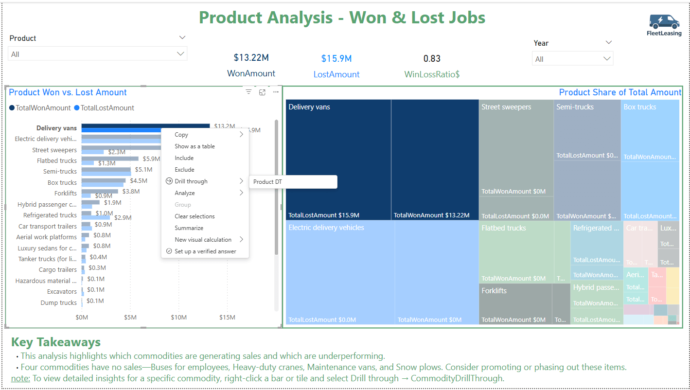
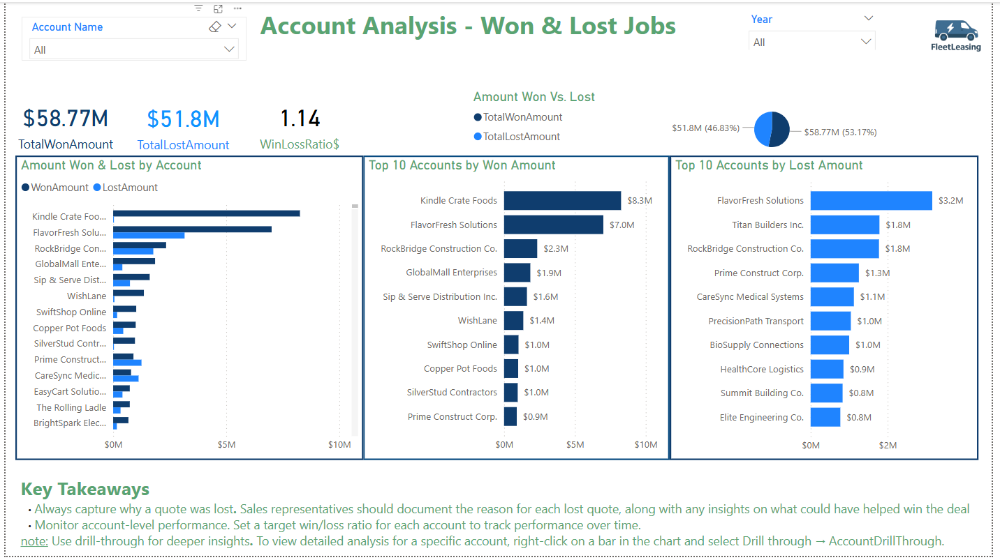

# 🚗 FleetLeasing Power BI Report

This Power BI report analyzes win/loss trends for the **fleet leasing industry**, using anonymized CRM opportunity data. It visualizes closed won/lost amounts, highlights account performance, and models target benchmarks to support business development strategies.

---

## 📊 Report Overview

- **Purpose**: Understand which jobs were lost or won—and uncover patterns by location, product, and rep.
- **Data Source**: Synthetic CRM-style opportunity pipeline data
- **Pages**:
  1. **Dashboard Summary**: High-level KPIs and interactive filters
  2. **Hub Breakdown**: Win/loss amounts by Hub
  3. **Commodity Trends**: Drill-through pages showing lost amounts by product
  4. **Opportunity Details**: Account and job-level exploration

---

## 🎬 Report Walkthrough Videos

Each video below walks through a core section of the report:

- 
- 
- 
- 

---

## 📄 Project Documentation

- [🔄 FleetLeasing ELT Process](./FleetLeasingELT_Process.md) – Data extraction, transformation, and model design  
- [🧮 FleetLeasing DAX Logic](./FleetLeasingDAX.md) – KPI calculations, filter logic, and business rules  
- [🎞️ FleetLeasing Presentation](./Assets/FleetLeasing_Presentation.pptx) – Interactive PowerPoint with embedded report and narrative overview

---

## ⚙️ Key Features

- Dynamic DAX KPIs with tooltips   
- Switch-driven Win/Loss messaging  
- Ranking by account and commodity  
- Target amount slicers with visual goals

---

## 🧠 Technologies Used

- Power BI Desktop  
- DAX (Data Analysis Expressions)  
- Custom tooltip pages & drillthroughs 
- Power Query for merging mapped tables & general cleaning   
- YouTube + PowerPoint for hosted demos and presentations
